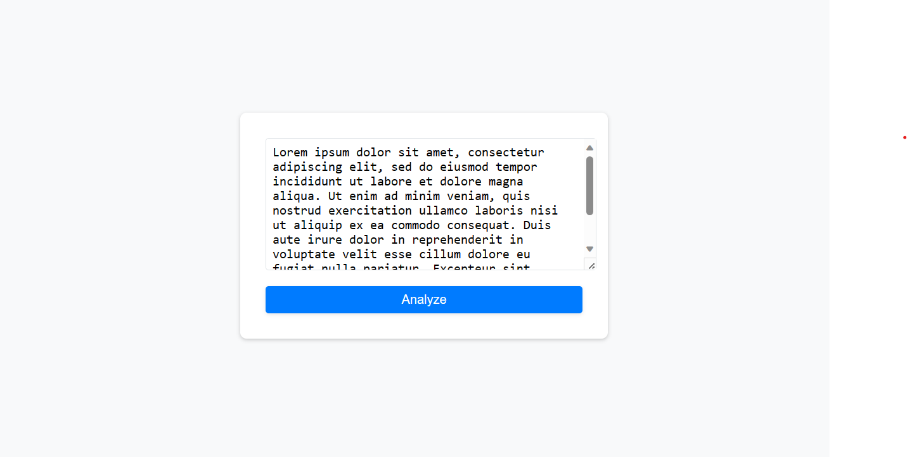
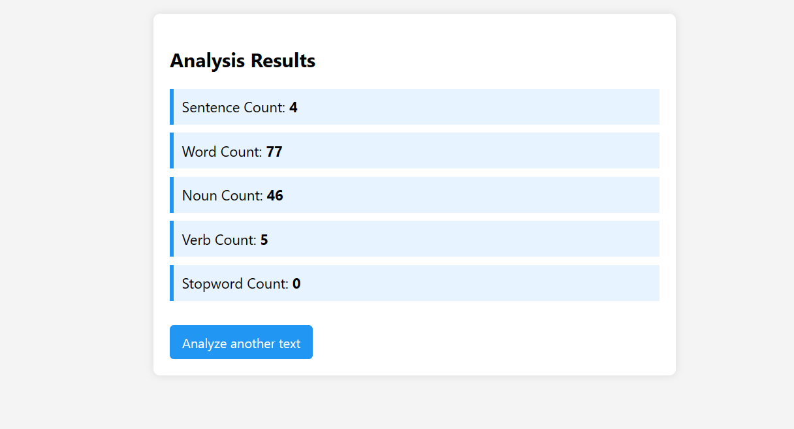

# NLP Statistics Analyzer

## Description

This Spring Boot application, "NLP Statistics Analyzer," leverages Apache OpenNLP for various natural language processing tasks. It provides functionalities such as sentence detection, word tokenization, parts of speech (POS) tagging, and stopword counting. The application offers a web interface where users can input text and receive a statistical breakdown including sentence count, word count, noun count, verb count, and stopword count.

## Prerequisites

To run this application, ensure you have the following:
- JDK [specify version, e.g., JDK 11]
- Maven [specify version, e.g., Maven 3.6]

## Installation

1. Clone the repository using `git clone [repository URL]`.
2. Navigate to the project directory.
3. Ensure that the required NLP models (`en-sent.bin`, `en-token.bin`, `en-pos-maxent.bin`) are placed in the `src/main/resources/models` directory.

## Running the Application

Execute the following command in the terminal:

```shell
mvn spring-boot:run
```

The application will start on `http://localhost:8080`. Navigate to this URL in a web browser to interact with the application.

## Features

- Sentence Detection
- Word Tokenization
- POS Tagging for Nouns and Verbs
- Stopword Counting
- Web Interface for Easy Interaction

## Usage

- Open the application in a web browser.
- Enter the text you want to analyze in the provided form.
- Submit the form to see the statistical analysis of the input text.

## Customization

- Expand the stopword list in `NLPService.java` for more comprehensive analysis.
- Update NLP models in the `src/main/resources/models` directory for different languages or improved accuracy.

## User Interface

The application provides a simple and intuitive web interface for easy interaction. Here is a look at the UI components:

### Text Input for Analysis

Users can enter the text they wish to analyze into the web interface, as shown below:



### Analysis Results

After analyzing the text, the application presents the results in a clear and organized manner:



## Additional Files in the Repository

### `Web Scrapping and NLP.ipynb`
- This Jupyter Notebook contains the Python code used for web scraping and preliminary NLP analysis. It's responsible for generating the data found in the `aggregated_results.csv` and `nlp_statistics.csv` files.

- This Jupyter Notebook, titled "Web Scraping and NLP," is an instructional guide that demonstrates the process of web scraping and applying Natural Language Processing (NLP) techniques using Python. It is structured as follows:

    ### 1. Importing Libraries
    This section includes the import statements of all the necessary Python libraries used in the notebook. These libraries are essential for web scraping, data handling, and NLP operations.
    
    ### 2. Link to the Website Used
    Here, the notebook specifies the target website from which data is scraped. It includes the URL and provides a brief description of the website's content and structure, setting the context for the scraping process.
    
    ### 3. Webpage Data Retrieval and Parsing
    This part of the notebook focuses on retrieving web data and parsing it. The section covers:
    - Making HTTP requests to the website.
    - Handling the response data, usually in HTML format.
    - Utilizing parsing libraries to extract meaningful information from the web data.

### `aggregated_results.csv`
- This CSV file is an output from the Jupyter Notebook. It contains aggregated statistical data related to NLP analysis such as sentence counts, word counts, etc., across multiple text sources.

### `nlp_statistics.csv`
- This CSV file, also generated by the Jupyter Notebook, provides detailed NLP statistics for individual text sources. It includes metrics like noun count, verb count, and stopword count for each analyzed text.

## Contact

For queries or feedback, please contact Ansh Kumar Dev at anshkumardev@gmail.com.
